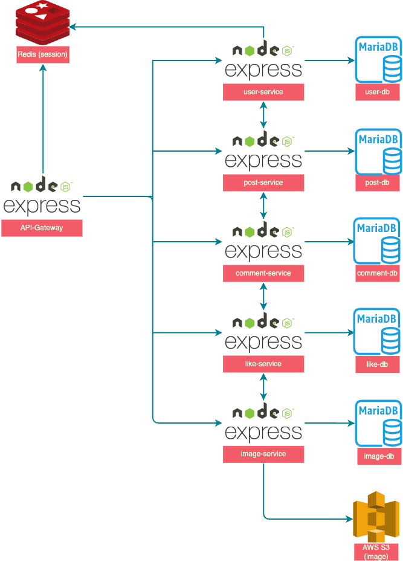

# 커뮤니티 서비스 아키텍처

## 개요
이 프로젝트는 **마이크로서비스 아키텍처(MSA)**를 기반으로 한 커뮤니티 웹 애플리케이션입니다.  
각각의 서비스는 독립적으로 동작하며, API Gateway를 통해 통합되어 사용자 요청을 처리합니다.  
사용자 인증, 게시물, 댓글, 좋아요, 이미지 업로드 기능 등이 분리된 서비스로 구성되어 있습니다.

---

## 시스템 아키텍처
아래는 프로젝트의 전체적인 시스템 구성입니다.

### 주요 구성 요소
1. **API Gateway (Express)**
   - 모든 클라이언트 요청은 API Gateway를 통해 처리됩니다.
   - 각 서비스로 요청을 라우팅하며, 사용자 세션 관리 및 인증을 담당합니다.

2. **Redis (Session Store)**
   - 사용자 세션 데이터를 관리합니다.
   - 빠른 세션 접근 및 인증 정보를 제공합니다.

3. **마이크로서비스**
   - 각 서비스는 **Express.js**로 구현되었으며, 고유의 역할과 데이터베이스를 가집니다.
     - **user-service**
       - 사용자 정보 관리
       - 연동된 데이터베이스: `user-db (MariaDB)`
     - **post-service**
       - 게시물 CRUD 처리
       - 연동된 데이터베이스: `post-db (MariaDB)`
     - **comment-service**
       - 댓글 CRUD 처리
       - 연동된 데이터베이스: `comment-db (MariaDB)`
     - **like-service**
       - 좋아요 기능 관리
       - 연동된 데이터베이스: `like-db (MariaDB)`
     - **image-service**
       - 이미지 업로드 및 저장
       - 연동된 데이터베이스: `image-db (MariaDB)`
       - 이미지 저장소: `AWS S3`

4. **데이터베이스**
   - 각 서비스별로 독립된 MariaDB 데이터베이스를 사용하여 데이터 무결성과 분리성을 유지합니다.

5. **AWS S3**
   - `image-service`에서 업로드된 이미지를 저장합니다.
   - 확장성과 안정성을 갖춘 클라우드 스토리지 솔루션입니다.

---

## 주요 기능
### 사용자 서비스 (`user-service`)
- 회원가입, 로그인, 사용자 정보 수정
- 비밀번호 재설정 및 탈퇴
- 회원정보 반환

### 게시물 서비스 (`post-service`)
- 게시물 작성, 조회, 수정, 삭제
- 게시물 목록 조회

### 댓글 서비스 (`comment-service`)
- 댓글 작성, 조회, 삭제

### 좋아요 서비스 (`like-service`)
- 게시물 및 댓글에 대한 좋아요 기능 제공
- 사용자별 좋아요 기록 관리

### 이미지 서비스 (`image-service`)
- 사용자 및 게시물 이미지 업로드
- 이미지 URL 반환 및 S3 저장

---